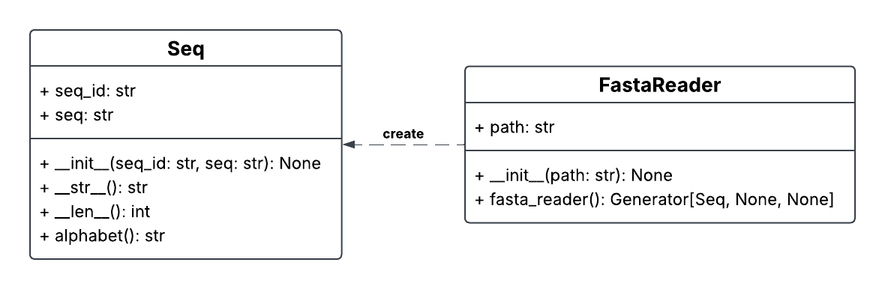

FASTA Project
=============

Документация проекта для чтения и обработки биологических
последовательностей в формате FASTA.

О проекте
---------

FASTA Project — учебный Python-проект, предназначенный для
работы с биологическими последовательностями.

Программа позволяет:

* читать FASTA-файлы, содержащие одну или несколько записей;
* хранить заголовок и последовательность в объекте класса Seq;
* определять длину биологической последовательности;
* определять предполагаемый тип алфавита;
* последовательно обрабатывать записи с помощью генератора;
* обнаруживать некоторые ошибки формата FASTA.

Структура проекта
-----------------

Проект включает два основных класса:

**Seq**

Хранит биологическую последовательность и её заголовок.
Предоставляет методы для получения длины, строкового
представления и определения типа алфавита.

**FastaReader**

Выполняет построчное чтение FASTA-файлов и последовательно
выдаёт объекты ``Seq``.

На UML-диаграмме представлены классы ``Seq`` и ``FastaReader``
и зависимость между ними.

Документация классов
--------------------

.. toctree::
   :maxdepth: 2

   seq
   fasta_reader
